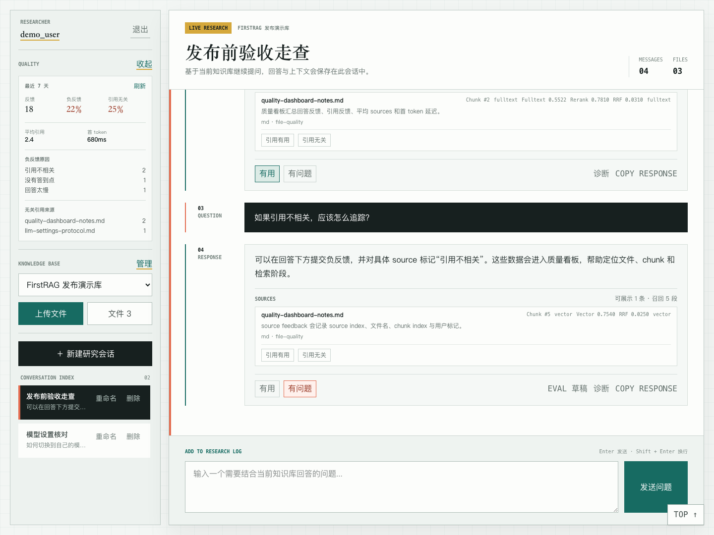
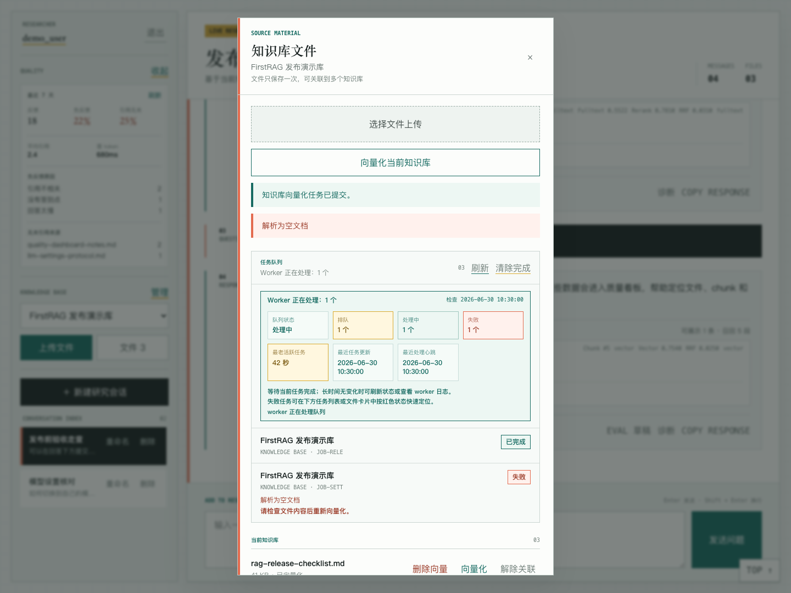
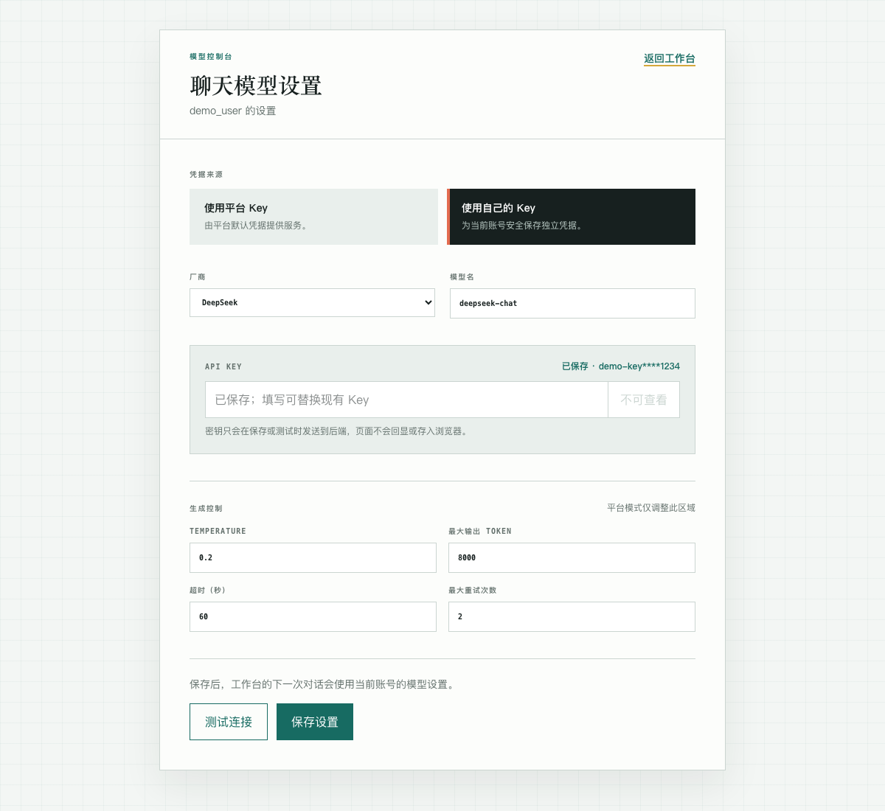

# FirstRAG

## 项目介绍

FirstRAG 是一个全栈 RAG（Retrieval-Augmented Generation，检索增强生成）应用，用于构建本地知识库问答系统。项目支持用户注册登录、知识库管理、文件上传、异步向量化、混合检索、模型设置和流式聊天回答。

当前仓库采用 monorepo 结构：

- `frontend/`：Next.js / React 前端。
- `backend/`：FastAPI 后端。
- `docs/`：项目架构、接口、数据结构和协作规范文档。

核心流程：

```text
上传文件 -> 解析切分 -> 向量化入库 -> 混合检索 -> LLM 流式回答 -> 展示来源与诊断
```

## 项目截图

以下截图基于当前前端 UI 和脱敏演示数据生成，不包含真实 API Key、JWT、数据库密码或私人文档内容。

### 聊天工作台与质量看板



工作台集中展示知识库选择、会话列表、RAG 回答、引用来源、引用反馈、回答反馈和质量看板。质量看板用于观察最近窗口内的负反馈、无关引用、平均 sources 和首 token 延迟。

### 知识库文件与任务队列



文件管理弹窗用于上传知识文件、复用已上传文件、触发单文件或整个知识库向量化，并查看 vector index worker 的队列状态、失败原因和恢复提示。

### 模型设置



模型设置页支持平台默认 Key 或用户自己的 Key。用户 Key 只在保存或测试时提交给后端，页面只展示脱敏保存状态，不回显完整密钥。

## 最短演示路径

本地最小演示建议先完成数据库迁移，然后在仓库根目录分别打开三个终端启动后端、前端和 worker。

```bash
# 初始化或升级数据库 schema
conda run -n firstrag python scripts/migrate_db.py --dry-run
conda run -n firstrag python scripts/migrate_db.py
```

终端 A：

```bash
cd backend
conda activate firstrag
python -m uvicorn app.main:app --reload --host 0.0.0.0 --port 8000
```

终端 B：

```bash
cd frontend
npm install
npm run dev
```

终端 C：

```bash
cd backend
conda activate firstrag
python -m app.workers.vector_index_worker
```

打开 `http://localhost:3000` 后，推荐试用顺序：

1. 注册并登录一个本地测试账号。
2. 进入“聊天模型设置”，选择平台 Key 或填写自己的 OpenAI-compatible provider。
3. 回到工作台，新建知识库并上传一份 `.md`、`.txt`、`.pdf` 或图片文件。
4. 在“文件”弹窗中触发向量化，等待任务队列完成。
5. 对当前知识库提问，检查回答、sources、retrieval diagnostics 和反馈入口。
6. 提交一次回答或引用反馈，再打开质量看板查看汇总。

也可以直接使用 Docker Compose 启动完整链路：

```bash
docker compose up --build
```

compose 会先运行 `migrate` service 初始化或升级 PostgreSQL schema，再启动后端、前端和 worker。

## 技术栈

| 模块 | 技术 |
| --- | --- |
| 前端 | Next.js, React, TypeScript |
| 后端 | FastAPI, Pydantic |
| 数据库 | PostgreSQL |
| 向量库 | Chroma |
| RAG 编排 | LangChain / LCEL |
| 检索 | 向量检索、PostgreSQL 全文检索、RRF、CrossEncoder rerank |
| 模型接口 | OpenAI 兼容协议，支持 DeepSeek、Qwen、Zhipu、Kimi、Doubao、Minimax 等 |
| 任务处理 | PostgreSQL 队列 + 独立 vector index worker |

## 快速开始

### 1. 准备环境

后端 Python 环境使用 conda，当前项目环境名为 `firstrag`。

```bash
conda activate firstrag
```

复制环境变量模板，并按需填写数据库、JWT、模型和 embedding 配置：

```bash
cp .env.example .env
```

后端运行时会读取仓库根目录的 `.env`。

初始化或升级 PostgreSQL schema：

```bash
conda run -n firstrag python scripts/migrate_db.py --dry-run
conda run -n firstrag python scripts/migrate_db.py
```

### 2. 启动后端

```bash
cd backend
conda activate firstrag
python -m uvicorn app.main:app --reload --host 0.0.0.0 --port 8000
```

### 3. 启动前端

```bash
cd frontend
npm install
npm run dev
```

默认访问：

```text
http://localhost:3000
```

### 4. 启动向量化 Worker

如果需要上传文件并执行向量化，单独启动 worker：

```bash
cd backend
conda activate firstrag
python -m app.workers.vector_index_worker
```

### 5. 可选：使用 Docker Compose

仓库提供本地 Docker Compose 方案，可启动 PostgreSQL、后端、前端和 worker：

```bash
docker compose up --build
```

compose 会挂载 `uploads/`、`vector_db/` 和 `models/`，并默认让后端与 worker 连接 compose 内的 `postgres` 服务。启动时会先运行 `migrate` service 初始化或升级 PostgreSQL schema，成功后再启动后端和 worker。更多细节见 `docs/DEPLOYMENT.md`。

## 项目结构

```text
FirstRAG/
├── frontend/                 # Next.js / React 前端
├── backend/                  # FastAPI 后端
├── docs/                     # 项目文档
├── deploy/                   # 部署相关
│   ├── docker/
│   └── nginx/
├── scripts/                  # 初始化、迁移、测试脚本
├── .env.example              # 环境变量模板
├── docker-compose.yml        # 本地 Docker Compose 配置
├── README.md
└── .gitignore
```

## 文档导航

| 文档 | 说明 |
| --- | --- |
| `docs/README.md` | 文档目录说明。 |
| `docs/ARCHITECTURE.md` | 系统架构和数据流。 |
| `docs/SCHEMAS.md` | 数据库表、Pydantic Schema 和核心结构。 |
| `docs/API.md` | 后端 API 与前端代理说明。 |
| `docs/RAG_WORKFLOW.md` | RAG 入库、检索和生成流程。 |
| `docs/FRONTEND.md` | 前端目录和开发约定。 |
| `docs/BACKEND.md` | 后端分层和服务说明。 |
| `docs/DEPLOYMENT.md` | 本地启动和部署约定。 |
| `docs/AGENT_GUIDE.md` | AI Agent / Codex / Claude Code 协作规范。 |
| `docs/CODING_STYLE.md` | 编码规范。 |

## Roadmap

- [x] 补充完整 Docker Compose 部署配置。
- [x] 增加前后端 CI 检查。
- [x] 完善数据库迁移执行脚本。
- [x] 补充项目截图和本地演示说明。
- [x] 增加 RAG 评估集、批量评估脚本和历史趋势摘要。
- [x] 明确在线演示环境方案与上线阻塞项。
- [ ] 发布在线演示环境（待域名/TLS、反向代理限流、演示账号和数据清理策略落地）。

## License

当前仓库暂不开放开源授权，详见 [LICENSE](./LICENSE)。代码可用于项目展示、学习和审查；未经版权持有人书面许可，不授予复制、修改、分发、再授权、商业使用或作为服务托管的权利。

后续如项目所有者确定采用 MIT、Apache-2.0、GPL 等开源协议，应替换 `LICENSE` 文件并同步更新本段说明。
