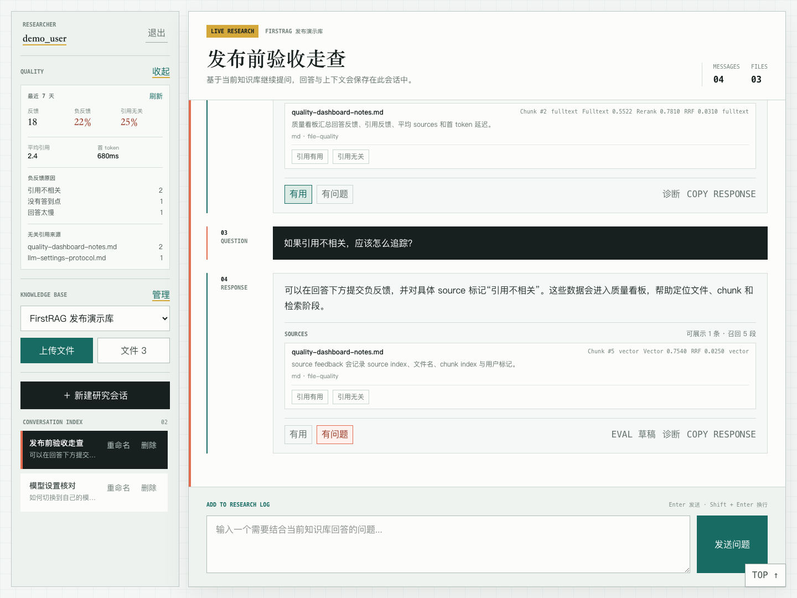
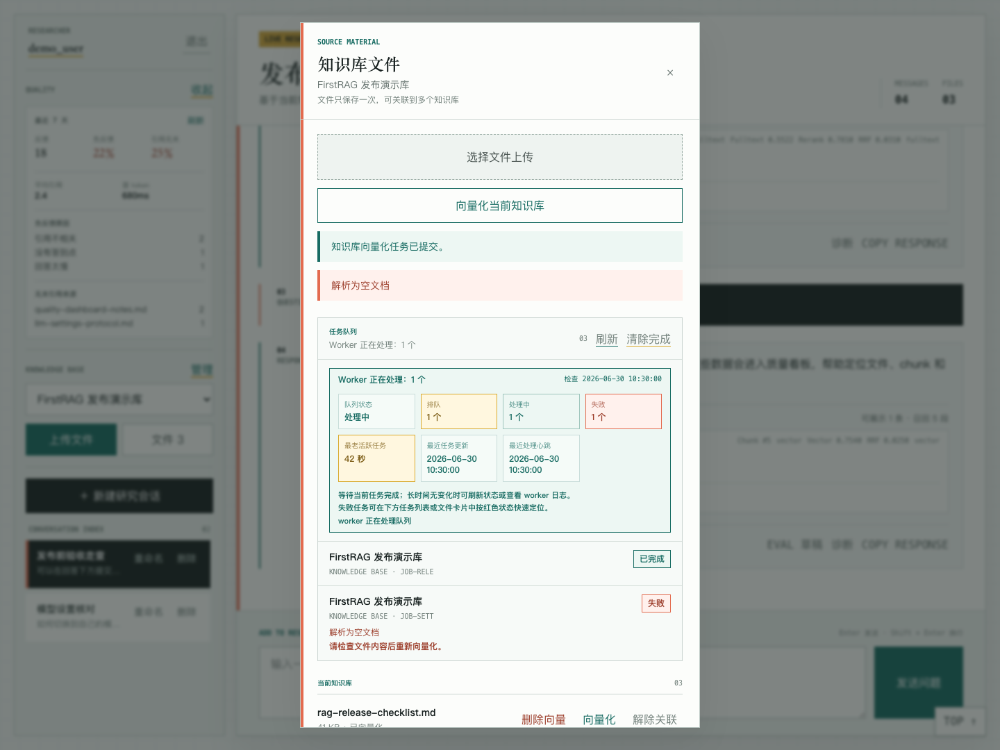
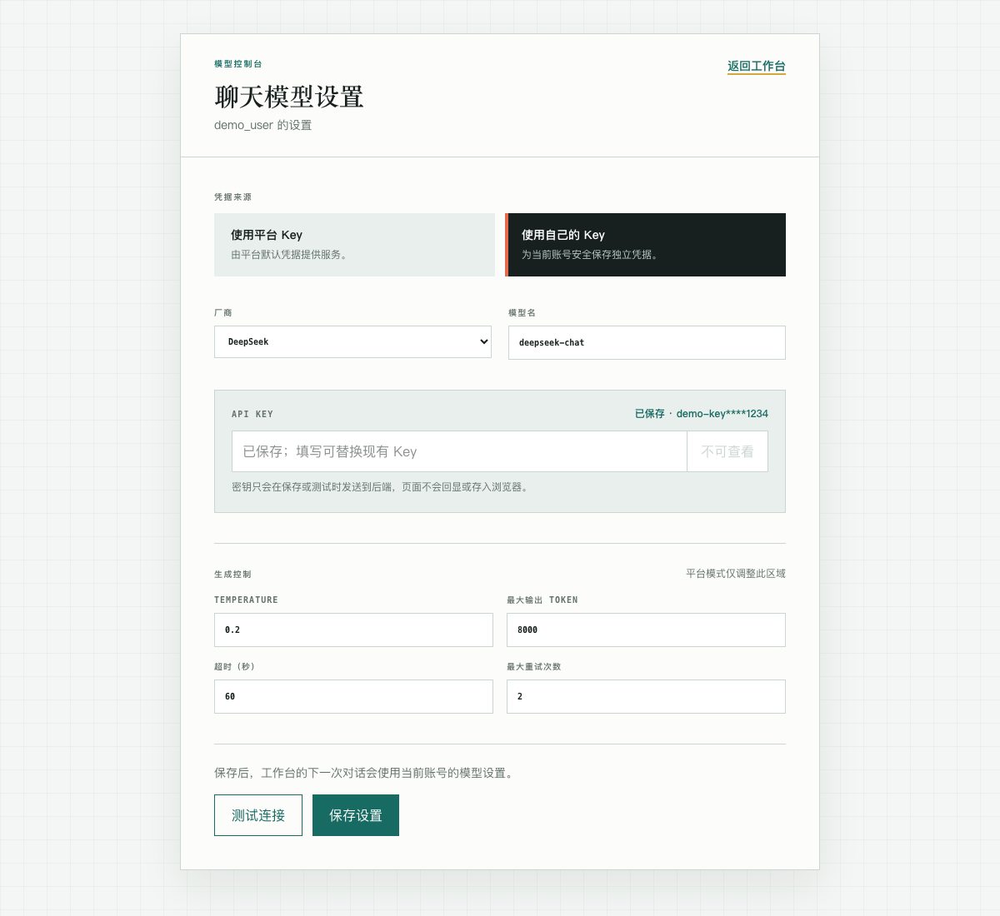

# FirstRAG

> 可运行的全栈 RAG 工程教程与参考实现

## 项目介绍

FirstRAG 是一个全栈 RAG（Retrieval-Augmented Generation，检索增强生成）应用，用于构建本地知识库问答系统。项目支持用户注册登录、知识库管理、文件上传、扫描 PDF 本地 OCR、质量诊断与人工校对、图片知识文件解析、异步向量化、混合检索、模型设置、聊天图片附件和流式回答。

当前仓库采用 monorepo 结构：

- `frontend/`：Next.js / React 前端。
- `backend/`：FastAPI 后端。
- `docs/`：项目架构、接口、数据结构和协作规范文档。

核心流程：

```text
上传文件 -> 解析切分 -> 向量化入库 -> 混合检索 -> LLM 流式回答 -> 展示来源与诊断
```

## 项目定位与维护阶段

当前产品链路已经完整，仓库进入“功能冻结、教程优先”的维护阶段：保留可运行的真实工程实现，在此基础上逐步补充学习路线、源码地图、可复现实验和进阶练习，不再以增加产品功能或单纯缩短文件行数为目标。

- `main` 是唯一长期主线；每项修改从 `main` 创建短期分支，通过 PR 和 required checks 合并。
- 非必要功能扩展暂停；Bug、安全漏洞、依赖兼容和教程可复现性所需的最小修复仍正常维护。
- 教程必须对应当前真实代码、API、数据表和部署行为，不把规划中的能力写成已实现功能。
- 教程化改造前的完整产品快照固定在 `product-v1.0.0` tag。
- 教程入口、四条学习路线、无外部密钥实验、专题章节、分级练习和文档门禁已按 [`PLAN-20260802-01`](docs/archive/TASKS_HISTORY.md#t-122-固化教程化前产品基线与维护边界) 完成交付。

## 你将学到什么

- 如何把文件上传、SHA-256 去重、持久任务队列、worker、OCR、chunk 和 embedding 组织成异步入库链路。
- 如何组合 Milvus dense/sparse filtered hybrid search、RRF 和可选 rerank，并保留可解释的 retrieval diagnostics。
- 如何通过 FastAPI、LCEL 和 Next.js API proxy 传递 SSE token、sources、usage 与失败状态。
- 如何隔离用户数据和 provider API Key，并在 route、service、repository 之间保持清晰边界。
- 如何使用 Docker Compose、migration、单元测试、Playwright、真实 eval 和 GitHub Actions 验证完整系统。

## 教程入口

| 路线 | 适合读者 | 入口 |
| --- | --- | --- |
| 快速入门 | 第一次接触 RAG，希望先理解系统如何运行。 | [教程导航：快速入门](docs/tutorials/README.md#路线一快速入门) |
| 后端与 RAG | 关注 FastAPI、异步 indexing、hybrid retrieval 和 SSE。 | [教程导航：后端与 RAG](docs/tutorials/README.md#路线二后端与-rag) |
| 前端 | 关注 Next.js proxy、React hooks、streaming 状态和引用 UI。 | [教程导航：前端](docs/tutorials/README.md#路线三前端) |
| 工程化 | 关注 Docker、CI、安全审计、评测和生产检查。 | [教程导航：工程化](docs/tutorials/README.md#路线四工程化) |

推荐先完成 [10 分钟导览](docs/tutorials/README.md#10-分钟导览)，再运行 [无外部密钥入门实验](docs/tutorials/CREDENTIAL_FREE_QUICKSTART.md)，沿 [文件入库与异步索引](docs/tutorials/FILE_INGESTION_AND_INDEXING.md) 从 `file_id` 追踪到双存储，并使用 [源码地图](docs/tutorials/CODE_MAP.md) 定位真实代码。隔离实验使用确定性 provider stub；运行完整应用仍需要用户自己的聊天与 embedding provider。

## 项目截图

以下截图基于当前前端 UI 和脱敏演示数据生成，不包含真实 API Key、JWT、数据库密码或私人文档内容。

### 聊天工作台与高级观察入口



工作台默认以普通模式展示知识库选择、会话列表、RAG 回答和引用来源。切换到高级模式后，可继续查看诊断、引用反馈、回答反馈、质量看板和检索参数；质量看板用于观察最近窗口内的负反馈、无关引用、平均 sources 和首 token 延迟。

### 知识库文件与任务队列



文件管理弹窗用于上传知识文件、复用已上传文件、触发单文件或整个知识库向量化，并查看 vector index worker 的队列状态、失败原因和恢复提示。

### 模型设置



模型设置页支持用户按聊天、向量和 rerank 厂商保存自己的 API Key。用户 Key 只在保存或测试时提交给后端，页面只展示脱敏保存状态，不回显完整密钥。

## 运行完整应用

本地最小演示默认使用 Docker Compose，在仓库根目录构建并启动完整链路：

```bash
docker compose up -d --build
```

Compose 会先运行 `migrate` 初始化或升级 PostgreSQL schema，启动固定版本的 Milvus Standalone、etcd 与 MinIO，并启动只在 Compose 内网提供服务的 CPU-only BGE-M3 sparse encoder；Milvus authenticated probe 与 sparse encoder 最小 inference 均通过后才启动 FastAPI backend 和 worker。BGE-M3 首次启动需要下载约 2.3 GB 固定 revision 权重，snapshot 与 Xet cache 建议预留至少 5 GB named volume 空间，CPU 环境加载会较慢。启动后查看服务状态和关键日志：

```bash
docker compose ps
docker compose logs --tail=100 redis postgres milvus-etcd milvus-minio milvus-standalone milvus-health-probe sparse-encoder migrate backend worker frontend
conda run -n firstrag python scripts/production_preflight.py --env-file .env --migration-method compose --skip-migration-dry-run --check-runtime-health
```

完整准备流程见 [`docs/docker-startup/README.md`](docs/docker-startup/README.md)。本地单独启动 FastAPI、Next.js 或 worker 仅作为专项调试方式，不再是默认验证路径。

打开 `http://localhost:3000` 后，推荐试用顺序：

1. 注册并登录一个本地测试账号。
2. 进入“聊天模型设置”，填写自己的 OpenAI-compatible provider。
3. 回到工作台，新建知识库并上传一份 `.md`、`.txt`、`.pdf`、`.docx`、`.png`、`.jpg/.jpeg` 或 `.webp` 文件；图片入库解析需要当前聊天模型支持 vision。
4. 在“文件”弹窗中触发向量化，等待任务队列完成。无文本层的扫描 PDF 会在 worker 内通过本地 Tesseract OCR；文件完成索引后可从“OCR 巡检”集中查看低置信度页面，批量选择页面进行灰度、二值化、页面旋转和多 PSM 自适应重识别，查看每页识别历史、候选选优、置信度趋势与相邻文本差异，或直接进入 PDF 原页与文本并排校对、差异高亮和异步索引重建。图片文件则由当前用户的 vision 聊天模型解析为可检索 Markdown，再进入 Milvus dense/sparse 检索。
5. 对当前知识库提问，检查回答和引用来源；如果当前聊天模型支持 vision，也可以在聊天框附加 PNG、JPEG 或 WebP 图片进行单轮多模态提问。
6. 如需调试检索效果，切换到高级模式后查看 retrieval diagnostics、提交反馈或打开质量看板。

修改 PDF OCR engine、预处理参数或 Tesseract runtime 后，运行不依赖账号、API Key 或用户文件的合成扫描页回归门禁：

```bash
conda run -n firstrag python scripts/eval_pdf_ocr.py
```

门禁覆盖正常页、90° 旋转、低对比度、模糊、中英文混排、轻度倾斜、盐椒噪点、侧边阴影、小字号和表格布局，直接复用生产 OCR engine，并同时约束逐样本相似度、旋转策略、宏平均质量和总耗时。每份报告带稳定 suite fingerprint，历史趋势不会混合不同版本的评测集。
CI 会保留每次 OCR 报告 artifact，并按相同 benchmark suite、runner 和 Tesseract 环境在 job summary 展示最近质量和耗时趋势；本地趋势命令与阈值见 [`docs/evals/README.md`](docs/evals/README.md#pdf-ocr-回归门禁)。

Docker 中的 `backend`、`migrate` 和 `worker` 复用精简后的 Python runtime 镜像；`torch`、`transformers` 和 `FlagEmbedding` 只安装在独立 `sparse-encoder` 镜像，避免 backend 与 worker 各加载一份 BGE-M3。当前 T-141 只交付 runtime 与共享 client，dense/sparse 写入和 Milvus hybrid search 分别由 T-142/T-143 接入。

## 技术栈

| 模块 | 技术 |
| --- | --- |
| 前端 | Next.js, React, TypeScript |
| 后端 | FastAPI, Pydantic |
| 数据库 | PostgreSQL |
| 缓存基础设施 | Redis（健康检查、RAG 热点共享缓存、后端分布式限流和 vector worker 运行态） |
| 向量库 | Milvus Standalone 3.0.0（etcd + MinIO） |
| 稀疏编码 | BGE-M3 fixed revision + FlagEmbedding 1.4.0（Compose 内网单实例） |
| RAG 编排 | LangChain / LCEL |
| 检索 | Milvus dense/sparse hybrid search、RRF、可选本地 CrossEncoder 或用户级远程 rerank |
| 模型接口 | OpenAI 兼容协议，支持 DeepSeek、Qwen、Zhipu、Kimi、Doubao、Minimax 等 |
| 任务处理 | PostgreSQL 队列 + 独立 vector index worker |

## 快速开始

### 1. 准备环境

后端 Python 环境使用 conda，当前项目环境名为 `firstrag`。

```bash
conda activate firstrag
```

复制环境变量模板，并按需填写数据库、JWT 和用户凭据加密密钥。聊天模型、向量模型和远程 rerank 的 provider、model、API Key 都在用户登录后的“模型设置”页保存，不再从 `.env` 读取；Docker 和后端无需这些 provider Key 也能启动。

```bash
cp .env.example .env
```

后端运行时会读取仓库根目录的 `.env`。

首次登录后，请先进入“模型设置”配置聊天模型和向量模型；如需远程 rerank，也在同页配置。未配置前可以登录和上传文件，但聊天模型调用与向量化会提示补充配置。

启动完整本地环境：

```bash
docker compose up -d --build
```

Compose 会启动 Redis、PostgreSQL、migration、FastAPI 后端、Next.js 前端和 worker，并挂载 `uploads/`、`vector_db/` 和 `models/`。Redis 默认只在 Compose 网络内提供缓存、限流和 worker 运行态，不映射公网端口；生产可通过 `REDIS_URL` 切到托管 Redis 内网或 `rediss://` 认证连接串。查看状态：

```bash
docker compose ps
docker compose logs --tail=100 redis migrate backend worker frontend postgres
```

默认访问：

```text
http://localhost:3000
```

### 2. 可选：本地调试 FastAPI

```bash
cd backend
conda activate firstrag
python -m uvicorn app.main:app --reload --host 0.0.0.0 --port 8000
```

本地单独启动后端只用于专项排查；常规验证请使用 Docker Compose。

### 3. 可选：本地调试 Next.js

```bash
cd frontend
npm install
npm run dev
```

本地单独启动前端只用于页面专项调试；常规验证请使用 Docker Compose。

### 4. 可选：本地调试向量化 Worker

```bash
cd backend
conda activate firstrag
python -m app.workers.vector_index_worker
```

本地单独启动 worker 只用于专项排查；常规验证请使用 Docker Compose。更多细节见 `docs/DEPLOYMENT.md`。

## 项目结构

```text
FirstRAG/
├── frontend/                 # Next.js / React 前端
├── backend/                  # FastAPI 后端
├── docs/                     # 项目文档
├── deploy/                   # 部署相关
│   ├── docker/
│   └── nginx/
├── scripts/                  # 初始化、迁移、测试脚本
├── .env.example              # 环境变量模板
├── docker-compose.yml        # 本地 Docker Compose 配置
├── README.md
└── .gitignore
```

## 文档导航

| 文档 | 说明 |
| --- | --- |
| `docs/tutorials/README.md` | 教程总览、四条学习路线和统一章节模板。 |
| `docs/tutorials/CREDENTIAL_FREE_QUICKSTART.md` | 无真实账号、API Key 或公网模型服务的隔离全栈实验。 |
| `docs/tutorials/FILE_INGESTION_AND_INDEXING.md` | 文件上传、异步索引、OCR、chunk 和双存储教程。 |
| `docs/tutorials/HYBRID_RETRIEVAL_AND_STREAMING.md` | 混合检索、RRF、rerank、SSE、消息落库与 diagnostics 教程。 |
| `docs/tutorials/FRONTEND_SECURITY_TESTING_AND_DEPLOYMENT.md` | 前端状态与 proxy、凭据安全、测试门禁、Compose 和生产部署边界教程。 |
| `docs/tutorials/fixtures/README.md` | 可追溯的 TXT、Markdown 和合成 OCR 教程素材。 |
| `docs/tutorials/CODE_MAP.md` | 从业务链路定位真实源码、测试和部署入口。 |
| `docs/README.md` | 文档目录说明。 |
| `docs/ARCHITECTURE.md` | 系统架构和数据流。 |
| `docs/SCHEMAS.md` | 数据库表、Pydantic Schema 和核心结构。 |
| `docs/API.md` | 后端 API 与前端代理说明。 |
| `docs/RAG_WORKFLOW.md` | RAG 入库、检索和生成流程。 |
| `docs/FRONTEND.md` | 前端目录和开发约定。 |
| `docs/BACKEND.md` | 后端分层和服务说明。 |
| `docs/DEPLOYMENT.md` | 本地启动和部署约定。 |
| `docs/AGENT_GUIDE.md` | AI Agent / Codex / Claude Code 协作规范。 |
| `docs/CODING_STYLE.md` | 编码规范。 |

## Roadmap

- [x] 完成认证、文件入库、异步索引、OCR、混合检索、SSE、诊断与反馈主链路。
- [x] 建立 Docker Compose、migration、production preflight、评测和 required CI checks。
- [x] 固化教程化前产品基线，明确功能冻结与 `main` 单主线维护边界（T-122）。
- [x] 建立教程入口、学习路线和源码地图（T-123）。
- [x] 建立不依赖真实 API Key 的入门实验（T-124）。
- [x] 编写文件入库与异步索引教程（T-125）。
- [x] 编写混合检索与流式回答教程（T-126）。
- [x] 编写前端、安全、测试与部署进阶教程（T-127）。
- [x] 增加练习、示例素材与文档回归门禁（T-128）。
- [x] 明确教程仓库 License 与公开使用边界（T-129）。

在线演示环境已有完整方案，但真实服务器、域名/TLS、生产配置和公网 smoke test 尚未落地；该事项暂不属于当前教程化主线。

## License

FirstRAG 的项目代码、文档和仓库自编教程素材采用 [Apache License 2.0](./LICENSE)，版权归属见 [NOTICE](./NOTICE)。在遵守许可证条款的前提下，可以使用、复制、修改、分发、再授权、商业使用或作为服务托管。

分发原始版本或衍生作品时，需要附带许可证、保留适用的版权与归属声明，并在修改过的文件中作出显著说明。许可证不授予商标使用权，软件按“原样”提供且不附带保证。

第三方依赖和外部服务继续适用各自的许可证与服务条款；用户上传内容、API Key 和运行时数据不因进入 FirstRAG 而改为 Apache-2.0。
