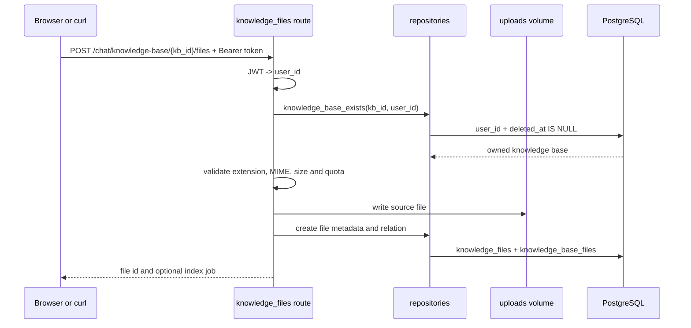
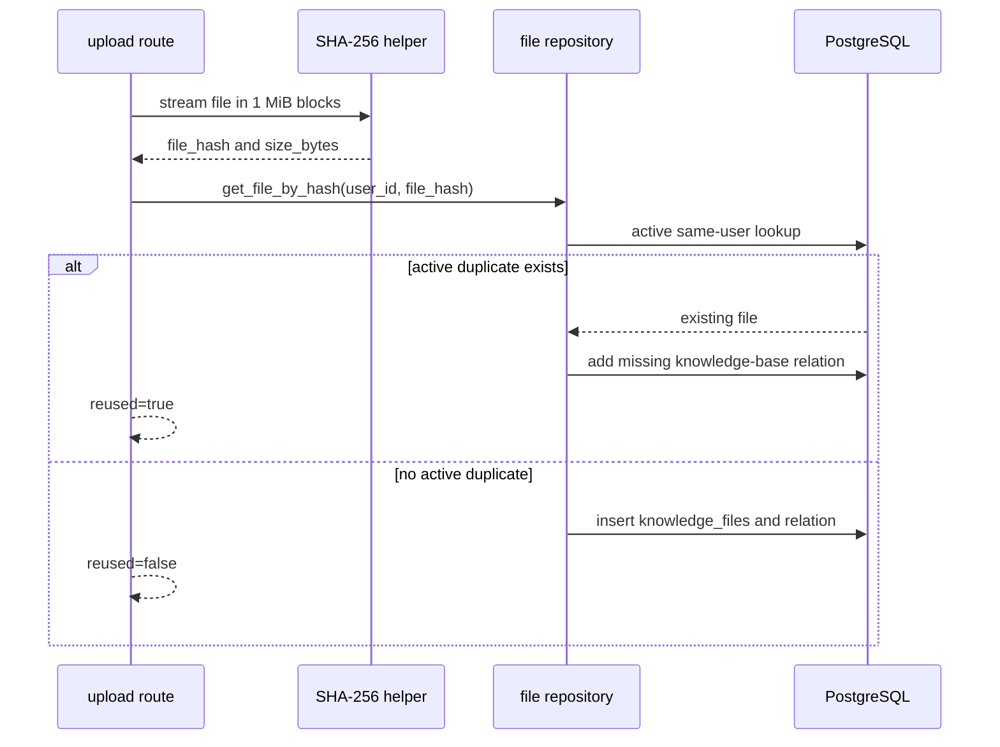
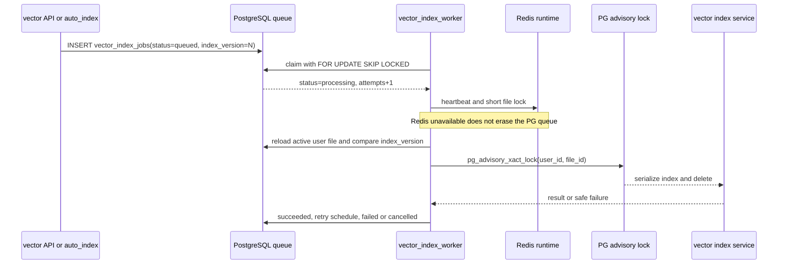
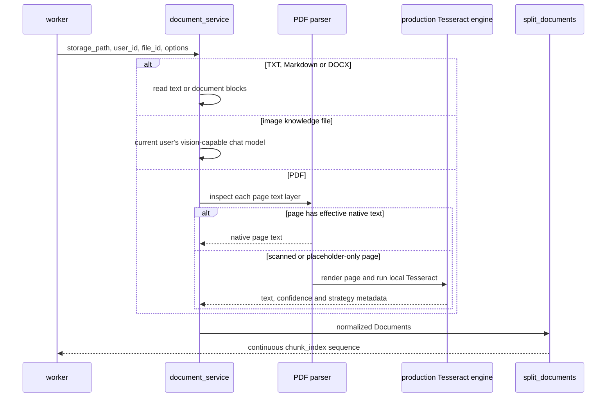
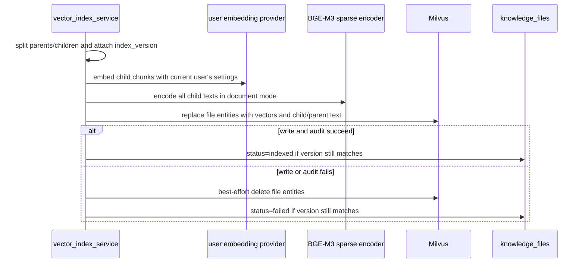

# 文件入库与异步索引

本教程沿一份文件的真实生命周期，追踪它如何从 HTTP upload 变成同时保存 dense/sparse vectors、child text 与 parent text 的 Milvus entity。内容对应当前生产代码，不另造简化版 indexing，也不会把解析、OCR 或 embedding 放回 HTTP request。

## 学习目标与实验边界

完成后，你将能够：

- 从一个 `file_id` 追踪 `vector_index_jobs`、Milvus text/vector metadata 和最终状态。
- 解释 `user_id`、`deleted_at`、SHA-256 和 `index_version` 分别解决什么问题。
- 区分 PostgreSQL 持久任务队列与 Redis worker 运行态。
- 解释扫描 PDF fallback、Milvus 写后审计、补偿清理和失败后的安全重试。

建议先完成[无外部密钥入门实验](CREDENTIAL_FREE_QUICKSTART.md)。本页的动手命令专门复用该实验暂停后的隔离 Compose project；它不会读取根目录 `.env`，也不会操作默认 FirstRAG 数据。除非命令另有说明，均从仓库根目录运行。

> 下文包含停止 worker、删除后重建 vector 的故障实验。只在 T-124 打印出的隔离 project 中执行；不要把默认 project 名填入这些命令。

## 准备一条可追踪链路

先在一个可交互终端启动并暂停无密钥实验：

```bash
FIRSTRAG_E2E_PAUSE_AFTER_TEST=1 scripts/run_full_stack_e2e.sh
```

看到通过结果和等待提示后，不要按 Enter。在另一个终端中填入脚本打印的 project、临时用户名和临时密码：

```bash
export FIRSTRAG_TUTORIAL_PROJECT="<打印的 Compose project>"
export FIRSTRAG_TUTORIAL_USERNAME="<打印的临时用户名>"
export FIRSTRAG_TUTORIAL_PASSWORD="<打印的临时密码>"
export FIRSTRAG_TUTORIAL_BACKEND="http://127.0.0.1:18080"

firstrag_tutorial_compose() {
  docker compose \
    --env-file /dev/null \
    -p "${FIRSTRAG_TUTORIAL_PROJECT}" \
    -f docker-compose.yml \
    -f deploy/docker/docker-compose.e2e.yml \
    "$@"
}

FIRSTRAG_TUTORIAL_LOGIN_RESPONSE="$({
  jq -nc \
    --arg username "${FIRSTRAG_TUTORIAL_USERNAME}" \
    --arg password "${FIRSTRAG_TUTORIAL_PASSWORD}" \
    '{username: $username, password: $password}'
} | curl -fsS \
  -H 'Content-Type: application/json' \
  --data-binary @- \
  "${FIRSTRAG_TUTORIAL_BACKEND}/login")"

export FIRSTRAG_TUTORIAL_TOKEN="$({
  printf '%s' "${FIRSTRAG_TUTORIAL_LOGIN_RESPONSE}"
} | jq -r '.access_token')"
export FIRSTRAG_TUTORIAL_USER_ID="$({
  printf '%s' "${FIRSTRAG_TUTORIAL_LOGIN_RESPONSE}"
} | jq -r '.user.id')"

export FIRSTRAG_TUTORIAL_KB_ID="$({
  curl -fsS \
    -H "Authorization: Bearer ${FIRSTRAG_TUTORIAL_TOKEN}" \
    "${FIRSTRAG_TUTORIAL_BACKEND}/chat/knowledge-bases"
} | jq -r '.knowledge_bases[] | select(.is_default == true) | .id')"

FIRSTRAG_TUTORIAL_FILES_RESPONSE="$(curl -fsS \
  -H "Authorization: Bearer ${FIRSTRAG_TUTORIAL_TOKEN}" \
  "${FIRSTRAG_TUTORIAL_BACKEND}/chat/knowledge-files")"
export FIRSTRAG_TUTORIAL_FILE_ID="$({
  printf '%s' "${FIRSTRAG_TUTORIAL_FILES_RESPONSE}"
} | jq -r '.files[] | select(.original_name == "t089-full-stack-source.txt") | .id')"
export FIRSTRAG_TUTORIAL_JOB_ID="$({
  printf '%s' "${FIRSTRAG_TUTORIAL_FILES_RESPONSE}"
} | jq -r '.files[] | select(.id == env.FIRSTRAG_TUTORIAL_FILE_ID) | .latest_index_job.id')"

printf 'user_id=%s\nknowledge_base_id=%s\nfile_id=%s\njob_id=%s\n' \
  "${FIRSTRAG_TUTORIAL_USER_ID}" \
  "${FIRSTRAG_TUTORIAL_KB_ID}" \
  "${FIRSTRAG_TUTORIAL_FILE_ID}" \
  "${FIRSTRAG_TUTORIAL_JOB_ID}"
```

`access_token` 只保留在当前 shell，不要打印、写入文档或提交到 Git。若 `FILE_ID` 或 `JOB_ID` 为空，先确认 T-124 的 Playwright 用例已经通过，并且这里填写的是同一个隔离 project 的临时账号。

完整链路可以先压缩成一张图：


## 第一章：上传与权限

### 时序



认证依赖把 JWT 转成 `user_id`。Route 在读取或修改文件前先验证知识库或文件属于该用户；Repository 的活动资源查询同时包含 `user_id` 和 `deleted_at IS NULL`。跨用户、已删除或不存在的资源统一返回 `404`，避免泄露资源是否存在。

上传只负责校验、SHA-256、落盘、metadata 和可选入队。`auto_index=true` 也只是创建任务，不会在 request 中解析文档或调用 embedding provider。

### 源码入口

| 边界 | 当前入口 | 观察重点 |
| --- | --- | --- |
| JWT 与用户上下文 | [`backend/app/core/security.py`](../../backend/app/core/security.py) | `get_current_user_id` 只产生当前用户 ID。 |
| 上传 Route | [`backend/app/api/knowledge_files.py`](../../backend/app/api/knowledge_files.py) | 所有权、文件校验、配额、落盘与 `auto_index`。 |
| 文件 helper | [`backend/app/services/file_service.py`](../../backend/app/services/file_service.py) | 1 MiB 流式 SHA-256、大小限制和用户隔离路径。 |
| Metadata Repository | [`backend/app/repositories/knowledge_file_repository.py`](../../backend/app/repositories/knowledge_file_repository.py) | 文件、知识库关联及活动资源过滤。 |

### 关键字段

| 表 | 字段 | 作用 |
| --- | --- | --- |
| `knowledge_bases` | `id`, `user_id`, `deleted_at` | 知识库归属与软删除边界。 |
| `knowledge_files` | `id`, `user_id`, `original_name`, `storage_path`, `mime_type`, `size_bytes` | 文件 metadata；API 不返回 `storage_path`。 |
| `knowledge_base_files` | `knowledge_base_id`, `knowledge_file_id` | 同一文件可关联多个当前用户的知识库。 |

### 可运行检查

使用当前用户 token 查询文件；响应只包含安全 metadata：

```bash
curl -fsS \
  -H "Authorization: Bearer ${FIRSTRAG_TUTORIAL_TOKEN}" \
  "${FIRSTRAG_TUTORIAL_BACKEND}/chat/knowledge-files" \
  | jq --arg file_id "${FIRSTRAG_TUTORIAL_FILE_ID}" \
      '.files[] | select(.id == $file_id)'
```

预期看到 `original_name=t089-full-stack-source.txt`、`status=indexed`，看不到磁盘路径、API Key 或 JWT。

### 故障注入与观察

用一个不存在的知识库 UUID 发起上传，只验证权限失败，不会创建文件：

```bash
printf '%s' 'permission boundary probe' > /tmp/firstrag-permission-probe.txt
curl -sS -o /tmp/firstrag-permission-response.json -w '%{http_code}\n' \
  -H "Authorization: Bearer ${FIRSTRAG_TUTORIAL_TOKEN}" \
  -F 'files=@/tmp/firstrag-permission-probe.txt;type=text/plain' \
  -F 'auto_index=false' \
  "${FIRSTRAG_TUTORIAL_BACKEND}/chat/knowledge-base/00000000-0000-0000-0000-000000000000/files"
jq . /tmp/firstrag-permission-response.json
```

预期 HTTP `404` 和“知识库不存在”。关键观察点不是错误文案，而是 Route 在落盘和创建 metadata 之前完成所有权检查。

## 第二章：SHA-256 去重与 metadata

### 时序



去重键是“同一用户 + 相同文件 bytes”，不是文件名。数据库的 partial unique index 只约束 `deleted_at IS NULL` 的活动文件，因此不会跨用户复用，也不会让已软删除记录重新暴露。

知识库软删除只隐藏知识库、原会话和关联视图，不删除可复用的文件与索引。当前 `DELETE /chat/knowledge-files/{file_id}` 是永久删除：它在用户权限、uploads 路径和 advisory lock 边界内清理关系、jobs、Milvus entities 与磁盘文件。不要把这两个生命周期混为一谈。

### 源码入口

| 边界 | 当前入口 | 观察重点 |
| --- | --- | --- |
| Hash 与落盘 | [`backend/app/services/file_service.py`](../../backend/app/services/file_service.py) | 内容 hash，而非文件名 hash。 |
| 去重 SQL | [`backend/app/repositories/knowledge_file_repository.py`](../../backend/app/repositories/knowledge_file_repository.py) | `user_id`, `file_hash`, `deleted_at IS NULL`。 |
| Schema 约束 | [`backend/app/db/sql/000_initial_schema.sql`](../../backend/app/db/sql/000_initial_schema.sql) | 活动文件 partial unique index。 |
| 删除编排 | [`backend/app/services/knowledge_file_lifecycle_service.py`](../../backend/app/services/knowledge_file_lifecycle_service.py) | 权限、锁、双存储、数据库与磁盘清理。 |

### 关键字段

| 字段 | 解释 |
| --- | --- |
| `file_hash` | 上传 bytes 的 SHA-256。 |
| `deleted_at` | 活动查询和活动唯一约束的边界；不要省略。 |
| `status` | 文件索引状态：`pending`, `queued`, `indexing`, `indexed`, `failed`。 |
| `index_version` | 当前允许写入的索引版本，初始为 `0`。 |

### 可运行检查：重复上传

重建 E2E 的同一份 bytes，即使文件名相同或不同，当前用户也应复用原 `file_id`：

```bash
printf '%s' \
  'FirstRAG credential-free full-stack evidence: T089 FULL STACK SOURCE.' \
  > /tmp/firstrag-duplicate-source.txt

curl -fsS \
  -H "Authorization: Bearer ${FIRSTRAG_TUTORIAL_TOKEN}" \
  -F 'files=@/tmp/firstrag-duplicate-source.txt;type=text/plain' \
  -F 'auto_index=false' \
  "${FIRSTRAG_TUTORIAL_BACKEND}/chat/knowledge-base/${FIRSTRAG_TUTORIAL_KB_ID}/files" \
  | jq '.files[0] | {id, reused, already_in_knowledge_base, status}'
```

预期 `id` 等于 `FIRSTRAG_TUTORIAL_FILE_ID`，`reused=true`。由于原文件已经关联默认知识库，`already_in_knowledge_base=true`。不会产生第二份磁盘文件或第二条活动 metadata。

用 PostgreSQL 验证时必须带用户与软删除条件：

```bash
firstrag_tutorial_compose exec -T postgres \
  psql -U firstrag -d first_rag \
  -v "user_id=${FIRSTRAG_TUTORIAL_USER_ID}" \
  -v "file_id=${FIRSTRAG_TUTORIAL_FILE_ID}" \
  -c "SELECT id, user_id, original_name, file_hash AS sha256,
             status, index_version
      FROM knowledge_files
      WHERE id = :'file_id'::uuid
        AND user_id = :'user_id'::bigint
        AND deleted_at IS NULL;"
```

### 故障注入与观察

把 `/tmp/firstrag-duplicate-source.txt` 改动一个字符再上传，应该得到新的 `file_id`；这证明去重依据 bytes。该新文件只存在于隔离实验中，最终会随 project volume 一起清理。

不要通过删除 SQL 条件来“演示跨用户访问”。安全的回归入口是 [`backend/tests/test_knowledge_files.py`](../../backend/tests/test_knowledge_files.py)，其中覆盖用户范围、重复上传与活动记录行为。

## 第三章：任务入队、worker 与并发保护

### 时序



`vector_index_jobs` 是持久队列和任务状态真相源。Worker 使用 `FOR UPDATE SKIP LOCKED` 领取任务，通过 `locked_at`、`heartbeat_at` 和 lease 回收超时任务。Redis 保存 worker heartbeat、短时文件处理锁和相关共享运行态；Redis 不可用时会降低可观测性和协同能力，但任务本身仍在 PostgreSQL。

同一用户、同一文件最多只有一个 `queued`/`processing` 活跃任务。`index_version` 防止旧任务覆盖新状态：删除 vector、OCR 重识别或人工校对会递增版本；worker 领取旧 job 后发现版本不匹配会取消或失败为 stale，所有文件状态更新也带 `expected_index_version`。PostgreSQL advisory lock 则串行化同一文件的 indexing 与删除，弥补 Milvus 和 PostgreSQL 无法共享单一事务的问题。

### 源码入口

| 边界 | 当前入口 | 观察重点 |
| --- | --- | --- |
| API 入队 | [`backend/app/api/vector_indexes.py`](../../backend/app/api/vector_indexes.py) | 当前用户文件检查、provider 设置和限流。 |
| Queue service | [`backend/app/services/vectors/vector_index_queue_service.py`](../../backend/app/services/vectors/vector_index_queue_service.py) | 跳过已索引文件、复用活跃任务、文件状态同步。 |
| Queue Repository | [`backend/app/repositories/vector_index_job_repository.py`](../../backend/app/repositories/vector_index_job_repository.py) | claim、lease、retry、active unique 和终态。 |
| Worker | [`backend/app/workers/vector_index_worker.py`](../../backend/app/workers/vector_index_worker.py) | PG claim、Redis 运行态、版本复查和 heartbeat。 |
| Advisory lock | [`backend/app/db/locks.py`](../../backend/app/db/locks.py) | 同一 `user_id + file_id` 的 index/delete 串行化。 |

### 关键状态与字段

持久 job 状态只有：`queued`, `processing`, `succeeded`, `failed`, `cancelled`。文件列表为了前端协议，会把最新持久任务的 `succeeded` 显示为 `completed`；`knowledge_files.status` 的成功态则是 `indexed`。三者不能混用。

| 字段 | 作用 |
| --- | --- |
| `attempts`, `max_attempts`, `available_at` | 失败后的有限次数、指数退避和下次可领取时间。 |
| `locked_by`, `locked_at`, `heartbeat_at` | worker lease 与僵尸任务回收。 |
| `index_version` | job 只能写入同版本文件。 |
| `error_message`, `result` | 内部失败摘要与成功结果；API 会进一步安全化。 |

### 可运行检查

任务详情接口返回持久状态：

```bash
curl -fsS \
  -H "Authorization: Bearer ${FIRSTRAG_TUTORIAL_TOKEN}" \
  "${FIRSTRAG_TUTORIAL_BACKEND}/chat/vector-index-jobs/${FIRSTRAG_TUTORIAL_JOB_ID}" \
  | jq '.job | {id, knowledge_file_id, index_version, status, attempts, result}'
```

T-124 已完成的 job 应是 `succeeded`。再查看队列和 Redis worker 运行态的合并视图：

```bash
curl -fsS \
  -H "Authorization: Bearer ${FIRSTRAG_TUTORIAL_TOKEN}" \
  "${FIRSTRAG_TUTORIAL_BACKEND}/chat/vector-index-jobs/health" \
  | jq '{queue, worker}'
```

### 故障注入：停止 worker 后持久排队

下面会删除样例的现有 vector/chunk、递增 `index_version`，然后在 worker 停止时重新入队。它只适用于隔离 project：

```bash
firstrag_tutorial_compose stop worker

curl -fsS -X DELETE \
  -H "Authorization: Bearer ${FIRSTRAG_TUTORIAL_TOKEN}" \
  "${FIRSTRAG_TUTORIAL_BACKEND}/chat/knowledge-files/${FIRSTRAG_TUTORIAL_FILE_ID}/vectors" \
  | jq '{file_id, chunks_deleted, message}'

FIRSTRAG_TUTORIAL_REINDEX_RESPONSE="$(curl -fsS -X POST \
  -H "Authorization: Bearer ${FIRSTRAG_TUTORIAL_TOKEN}" \
  "${FIRSTRAG_TUTORIAL_BACKEND}/chat/knowledge-files/${FIRSTRAG_TUTORIAL_FILE_ID}/vectors")"
export FIRSTRAG_TUTORIAL_JOB_ID="$({
  printf '%s' "${FIRSTRAG_TUTORIAL_REINDEX_RESPONSE}"
} | jq -r '.job.id')"
printf '%s' "${FIRSTRAG_TUTORIAL_REINDEX_RESPONSE}" \
  | jq '.job | {id, index_version, status}'
```

此时 job 应保持 `queued`，即使 Redis 和 worker 运行态发生变化，PostgreSQL 记录仍在。启动 worker 后轮询终态：

```bash
firstrag_tutorial_compose start worker

for attempt in {1..30}; do
  FIRSTRAG_TUTORIAL_JOB_RESPONSE="$(curl -fsS \
    -H "Authorization: Bearer ${FIRSTRAG_TUTORIAL_TOKEN}" \
    "${FIRSTRAG_TUTORIAL_BACKEND}/chat/vector-index-jobs/${FIRSTRAG_TUTORIAL_JOB_ID}")"
  FIRSTRAG_TUTORIAL_JOB_STATUS="$({
    printf '%s' "${FIRSTRAG_TUTORIAL_JOB_RESPONSE}"
  } | jq -r '.job.status')"
  printf 'attempt=%s status=%s\n' "${attempt}" "${FIRSTRAG_TUTORIAL_JOB_STATUS}"
  case "${FIRSTRAG_TUTORIAL_JOB_STATUS}" in
    succeeded|failed|cancelled) break ;;
  esac
  sleep 2
done
printf '%s' "${FIRSTRAG_TUTORIAL_JOB_RESPONSE}" \
  | jq '.job | {id, index_version, status, attempts, failure_type, failure_hint}'
```

预期恢复为 `succeeded`。旧成功 job 仍保留审计记录，但它的旧 `index_version` 不再代表文件当前状态。

## 第四章：文档解析与扫描 PDF OCR

### 时序



当前支持 `.pdf`、`.docx`、`.md`、`.txt`、`.png`、`.jpg/.jpeg` 和 `.webp`。Markdown 保留标题层级，DOCX 保留段落范围，PDF 逐页保留位置。图片知识文件使用当前用户配置的 vision-capable chat model；扫描 PDF fallback 使用 Compose backend 内的本地 Tesseract，默认 `chi_sim+eng`，不调用聊天模型或第三方 OCR API。

PDF 先尝试原生文本层。没有有效正文、只有图片 placeholder 的页面才进入 OCR。页级 metadata 会记录实际采用的 parse method、confidence、quality、word count、attempt 和策略；没有有效 word confidence 时为 `unknown`，不会构造虚假分数。

### 源码入口

| 边界 | 当前入口 | 观察重点 |
| --- | --- | --- |
| 文档加载与切分 | [`backend/app/services/documents/document_service.py`](../../backend/app/services/documents/document_service.py) | 类型分派、PDF page、OCR fallback、1000/200 chunk。 |
| OCR engine | [`backend/app/services/documents/pdf_ocr_engine.py`](../../backend/app/services/documents/pdf_ocr_engine.py) | Tesseract 基线与受控候选。 |
| OCR 质量 | [`backend/app/services/documents/pdf_ocr_quality_service.py`](../../backend/app/services/documents/pdf_ocr_quality_service.py) | 置信度、质量等级和巡检视图。 |
| OCR 历史 | [`backend/app/services/documents/pdf_ocr_history_service.py`](../../backend/app/services/documents/pdf_ocr_history_service.py) | 页、版本、attempt 和 source job。 |
| 合成门禁 | [`scripts/eval_pdf_ocr.py`](../../scripts/eval_pdf_ocr.py) | 直接调用生产 OCR engine 的退化样例。 |

### 关键 metadata

所有 chunk 都带 `user_id`, `file_id`, `file_name`, `file_type`, `chunk_index`, `index_version`。PDF 还可带 `page_number`, `page_count`, `pdf_parse_method`；OCR 页可带 `ocr_confidence`, `ocr_quality`, `ocr_word_count`, `ocr_attempt`, `ocr_strategy`, `ocr_preprocessing`, `ocr_psm`, `ocr_rotation`, `ocr_candidate_count`。

这些字段用于引用定位和诊断，不应把 `source` 中的内部存储路径直接返回给浏览器。

### 可运行检查

先确认 Compose backend 的实际语言包：

```bash
firstrag_tutorial_compose exec -T backend tesseract --list-langs
```

再在宿主机 `firstrag` conda 环境运行当前合成 OCR regression gate：

```bash
conda run -n firstrag python scripts/eval_pdf_ocr.py
```

该 gate 用合成扫描退化样例直接验证生产 OCR engine，适合捕获代码、预处理、Tesseract runtime 和语言包回归。它不经过 upload、数据库、chunk 或 embedding，也不等同于真实文档 OCR 精度评测；只有针对真实语料单独标注和计算后，才能报告真实准确率。

### 故障注入与观察

安全的超时与 fallback 注入已经固化为后端测试，不需要破坏本机 Tesseract：

```bash
(
  cd backend
  conda run -n firstrag python -m unittest \
    tests.services.test_document_service.DocumentServiceTests.test_pdf_ocr_timeout_returns_safe_error \
    tests.services.test_document_service.DocumentServiceTests.test_mixed_pdf_only_uses_ocr_for_scanned_page
)
```

超时用例应产生安全 OCR error；混合 PDF 用例应只对扫描页调用 OCR。真实任务失败时，通过 job API 观察 `failure_type=ocr_error`、`failure_hint` 和 `can_retry=true`，详细异常只看 worker 日志，不把内部路径或凭据送到前端。

## 第五章：chunk、embedding 与 Milvus 文本/向量存储

### 时序



切分先构造 parent，再只在 parent 内构造 child：Markdown 优先按标题，PDF 至少保持 page 边界，DOCX 沿用标题和段落组；无结构文本的默认 parent 是 `chunk_size=2000`、`chunk_overlap=0`。child 默认使用 `chunk_size=600`、`chunk_overlap=100`，overlap 不会跨 parent。多页或多 block 文档的 `chunk_index` 在同一用户、同一文件内仍全局连续。

稳定 ID 格式是：

```text
parent_id = {user_id}:{file_id}:v{index_version}:p{parent_index}
child_id  = {parent_id}:c{child_index}
```

Dense embedding 使用当前用户保存的 provider、model、dimensions 和加密凭据。v3 collection identity 还包含固定 BGE-M3 model/revision 与 `schema=v3_milvus_text`；worker 会先为所有 child 生成 dense 与 learned sparse，两路都成功才开始 Milvus mutation。每个 child entity 写入：

- dense `embedding` 与 BGE-M3 `sparse_embedding`。
- child `content` 与所属 parent 的 `parent_content`。
- `parent_id`、`parent_index`、`child_index`、全局 `chunk_index`、`index_version` 与 source/OCR/location metadata。

Milvus 写入或写后对账失败时，补偿会删除当前 collection identity 的半成品并把文件标记为 `failed`；用户永久删除文件时才扫描该用户全部 collection identities。`job.status=succeeded` 证明 count、stable IDs、child/parent text 与 dense/sparse self-hit 门禁通过，但不单独证明任意 query 的召回质量；检索质量仍要用当前 indexing/RAG eval 验证。

### 源码入口

| 边界 | 当前入口 | 观察重点 |
| --- | --- | --- |
| Index 编排 | [`backend/app/services/vectors/vector_index_service.py`](../../backend/app/services/vectors/vector_index_service.py) | stable IDs、parent text 附加、用户 collection 与补偿清理。 |
| Vector store 契约 | [`backend/app/services/vectors/vector_store.py`](../../backend/app/services/vectors/vector_store.py) | `Document`、stable ID、单文件替换/删除、检索、审计、计数和健康检查。 |
| Milvus adapter | [`backend/app/services/vectors/milvus_vector_store.py`](../../backend/app/services/vectors/milvus_vector_store.py) | v3 schema、双编码原子写入、text fields、scalar filter、Strong consistency 和写后审计。 |
| Sparse client | [`backend/app/services/sparse_encoder_client.py`](../../backend/app/services/sparse_encoder_client.py) | 固定 BGE-M3 identity、document/query mode 与安全错误边界。 |
| Embedding 设置 | [`backend/app/services/vectors/embedding_settings_service.py`](../../backend/app/services/vectors/embedding_settings_service.py) | 当前用户 provider/model/dimensions。 |
| Embedding client | [`backend/app/services/vectors/embedding_model.py`](../../backend/app/services/vectors/embedding_model.py) | OpenAI-compatible/Qwen/ZhipuAI 请求适配。 |
| Text read service | [`backend/app/services/vectors/knowledge_text_service.py`](../../backend/app/services/vectors/knowledge_text_service.py) | source preview 与 OCR 工具按 file/version 读取 Milvus child/parent text。 |

### 关键字段

| 存储 | 字段 | 约束或用途 |
| --- | --- | --- |
| Milvus vectors | `embedding`, `sparse_embedding` | dense COSINE 与 sparse IP retrieval。 |
| Milvus text | `content`, `parent_content` | child rerank/source 与 LLM parent context。 |
| Milvus identity | `chunk_id`, `parent_id`, `parent_index`, `child_index`, `user_id`, `file_id`, `chunk_index`, `index_version` | 父子归属、scalar filter 和版本审计。 |
| `knowledge_files` | `status`, `error_message`, `index_version` | 当前文件索引状态。 |

### 可运行检查：Milvus text 与 metadata

通过 backend 使用项目自己的 collection 命名与用户 embedding 设置，且只打印白名单字段：

```bash
firstrag_tutorial_compose exec -T \
  -e FIRSTRAG_TUTORIAL_USER_ID="${FIRSTRAG_TUTORIAL_USER_ID}" \
  -e FIRSTRAG_TUTORIAL_FILE_ID="${FIRSTRAG_TUTORIAL_FILE_ID}" \
  backend python -c '
import os
from app.services.vectors.vector_store_factory import get_vector_store

user_id = int(os.environ["FIRSTRAG_TUTORIAL_USER_ID"])
file_id = os.environ["FIRSTRAG_TUTORIAL_FILE_ID"]
rows = get_vector_store(user_id=user_id).list_file_vectors(
    user_id=user_id,
    file_id=file_id,
)
safe_keys = ("user_id", "file_id", "file_name", "file_type", "chunk_index", "index_version", "parent_id")
for row in rows:
    metadata = row.document.metadata
    print(
        row.id,
        {key: metadata.get(key) for key in safe_keys},
        "child_chars=", len(row.document.page_content),
        "parent_chars=", len(str(metadata.get("parent_content") or "")),
    )
'
```

这里故意不打印正文和 `source`，避免教程日志泄露企业文本或容器路径。预期至少一行，child/parent 字符数均大于 0，`user_id`、`file_id`、`chunk_index`、`index_version` 对齐。

最后核对 PostgreSQL 中只保留 file/job 状态：

```bash
firstrag_tutorial_compose exec -T postgres \
  psql -U firstrag -d first_rag \
  -v "user_id=${FIRSTRAG_TUTORIAL_USER_ID}" \
  -v "file_id=${FIRSTRAG_TUTORIAL_FILE_ID}" \
  -c "SELECT f.id AS file_id, f.status AS file_status, f.index_version,
             j.id AS latest_job_id, j.status AS latest_job_status
      FROM knowledge_files AS f
      LEFT JOIN LATERAL (
        SELECT id, status
        FROM vector_index_jobs
        WHERE user_id = f.user_id
          AND knowledge_file_id = f.id
          AND index_version = f.index_version
        ORDER BY created_at DESC
        LIMIT 1
      ) AS j ON true
      WHERE f.id = :'file_id'::uuid
        AND f.user_id = :'user_id'::bigint
        AND f.deleted_at IS NULL
      ;"
```

正常终态是 `file_status=indexed`、`latest_job_status=succeeded`；文本计数以刚才的 Milvus 列表结果为准。

### 故障注入与恢复

优先运行无破坏的恢复协议测试：

```bash
(
  cd backend
  conda run -n firstrag python -m unittest \
    tests.test_vector_index_failure_recovery \
    tests.test_vector_index_worker.VectorIndexWorkerLoggingTests.test_process_empty_document_failure_marks_job_failed
)
```

这些用例验证稳定的 `failure_type`、脱敏错误、恢复提示、重试契约和空文档失败终态。真实故障的观察顺序是：

1. `GET /chat/vector-index-jobs/{job_id}` 查看 `status`, `attempts`, `failure_type`, `failure_hint`, `can_retry`。
2. `GET /chat/vector-index-jobs/health` 区分队列卡住、worker 离线和 Redis 运行态降级。
3. `firstrag_tutorial_compose logs --tail=100 worker backend milvus-standalone milvus-health-probe provider-stub` 查看详细原因；不要复制 secret。
4. 修复 provider、Milvus/etcd/MinIO、数据库或文件问题后，再次 `POST /chat/knowledge-files/{file_id}/vectors`。没有活跃任务时会创建新 job；不要手工把旧 job 改成 `queued`。

Worker 对可重试失败最多执行 `max_attempts` 次并使用指数退避；达到上限才进入 `failed`。Milvus 写入或对账失败时，补偿逻辑会清除当前 identity 中该文件的半成品，避免把不完整数据标成 `indexed`。

## 状态追踪速查

| 想确认的问题 | 真相源 | 安全检查 |
| --- | --- | --- |
| 文件是否属于当前用户且活动 | `knowledge_files` | API 或 SQL 同时带 `user_id`、`deleted_at IS NULL`。 |
| 哪个任务代表当前索引 | `vector_index_jobs` | `knowledge_file_id + user_id + index_version`。 |
| worker 是否领取或卡住 | PostgreSQL job + Redis runtime | job endpoint 和 health endpoint 联合判断。 |
| child/parent text 与 vector metadata 是否存在 | 用户/embedding identity 隔离的 Milvus collection | scalar filter 同时包含 `user_id` 和 `file_id`，并检查两类文本非空。 |
| 是否真正可检索 | retrieval/evaluation | 不能只看 job 成功；继续 T-126 或运行当前 eval。 |

## 分级练习

### 基础练习

凭据要求：不需要真实 API Key。画出 `POST upload` 与 `POST vectors` 的边界，并解释为什么前者不应等待 embedding 完成。然后把 PostgreSQL 的 `file_id/index_version/job` 与 Milvus 的 filtered entities 串起来。

自检方向：upload 的终点是文件、metadata、关联和可选入队；embedding 由 worker 消费持久 job 后执行。有效 Milvus entity 必须与文件当前 `index_version` 一致，且同时具有 child/parent text，不能只按 `file_id` 统计历史残留。

### 诊断练习

执行“停止 worker 后持久排队”实验，对比 worker 停止和恢复前后的 job、queue health、Redis runtime 与文件状态。说明哪个信息来自 PostgreSQL，哪个来自 Redis。

自检方向：job、attempts 和文件状态是 PostgreSQL 持久事实；worker heartbeat/runtime 和共享限流/缓存状态在 Redis。worker 恢复后应领取原 `queued` job，而不是由浏览器重新构造任务。

### 扩展练习

先用 [`ocr_ground_truth.txt`](fixtures/ocr_ground_truth.txt) 和 `scripts/generate_tutorial_ocr_fixture.py` 生成合成 PNG，核对 ground truth、生成图和 OCR 输出之间的差异；再选择一个包含原生文本页和扫描页的自有 PDF，在独立测试账号中上传，记录页级 `pdf_parse_method` 并运行 OCR gate。不要用合成素材的结果代替真实 PDF 的准确率结论。

自检方向：合成 PNG 的来源和期望文本完全可追溯，适合学习 pipeline；真实 PDF 才能暴露版式、字体、噪声和扫描设备差异。两类结果必须分开记录。

## 清理与验证

完成观察后回到 T-124 的终端按 Enter，脚本会删除本次隔离 project 的 containers、network 和 volumes。不要对默认 FirstRAG project 运行 `down --volumes`。

维护本教程时至少运行：

```bash
conda run -n firstrag python scripts/eval_pdf_ocr.py
scripts/run_full_stack_e2e.sh
git diff --check
```

相关后端边界测试包括：

- [`backend/tests/test_knowledge_files.py`](../../backend/tests/test_knowledge_files.py)
- [`backend/tests/test_vector_indexes.py`](../../backend/tests/test_vector_indexes.py)
- [`backend/tests/test_vector_index_worker.py`](../../backend/tests/test_vector_index_worker.py)
- [`backend/tests/test_vector_index_failure_recovery.py`](../../backend/tests/test_vector_index_failure_recovery.py)
- [`backend/tests/services/test_document_service.py`](../../backend/tests/services/test_document_service.py)
- [`backend/tests/services/test_vector_index_service.py`](../../backend/tests/services/test_vector_index_service.py)

Reference：[教程示例素材](fixtures/README.md)、[API](../API.md)、[数据库结构](../SCHEMAS.md)、[RAG 核心流程](../RAG_WORKFLOW.md)、[PDF OCR 回归门禁](../evals/README.md#pdf-ocr-回归门禁)、[源码地图](CODE_MAP.md#文件入库与异步索引)。下一章是[混合检索与流式回答](HYBRID_RETRIEVAL_AND_STREAMING.md)。
