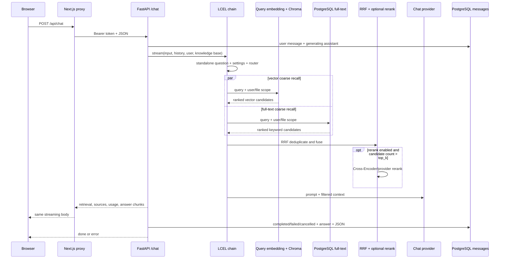

# 混合检索与流式回答

本教程沿一次真实提问，追踪它如何经过检索决策、query embedding、Chroma vector search、PostgreSQL full-text search、RRF、可选 rerank 和 LCEL，最后以 SSE 持续返回回答，并把答案、sources 与 retrieval diagnostics 写回 PostgreSQL。

## 学习目标与实验边界

完成后，你将能够：

- 从一次 `/chat` 请求定位 vector、full-text、fusion、rerank、first token 和完整回答阶段。
- 解释向量语义召回与全文关键词召回为何并行存在，以及 RRF 为什么不比较两路原始分数。
- 读懂 query embedding cache、降级状态、阶段耗时、sources 和 assistant message 状态。
- 解释 Next.js proxy 为什么必须直接转发 streaming body。
- 区分无密钥 E2E 的工程链路结论与真实 provider 的 RAG 质量指标。

建议先完成[无外部密钥入门实验](CREDENTIAL_FREE_QUICKSTART.md)和[文件入库与异步索引](FILE_INGESTION_AND_INDEXING.md)。本页的动手命令复用 T-124 暂停后的隔离 Compose project，不读取根目录 `.env`，也不操作默认 FirstRAG 数据。除非另有说明，命令均从仓库根目录运行。

## 一次请求的完整位置



Route 先验证会话属于当前用户且属于请求中的知识库。链路只从该知识库中 `status='indexed'` 的文件取 `file_id`；vector metadata filter 和 full-text SQL 再分别施加 `user_id` 与文件范围。没有通过权限和索引状态边界的 chunk 不会进入候选池。

## 第一章：检索决策与 LCEL 阶段

`POST /chat` 的请求体是：

```json
{
  "conversation_id": "<conversation UUID>",
  "knowledge_base_id": "<knowledge base UUID>",
  "message": "用户问题",
  "attachment_ids": []
}
```

FastAPI 创建 chain 成功后，先持久化 user message，再创建 `status='generating'` 的空 assistant message。LCEL chain 按以下顺序逐步补充同一份输入：

```text
standalone_question
  -> llm_diagnostics
  -> retrieval_settings
  -> knowledge_profile
  -> raw_retrieval_decision
  -> retrieval_decision
  -> context
  -> answer stream
```

`auto` 模式可调用 query router，`always` 强制检索，`never` 跳过检索；确定性规则还会用知识库画像和问题特征修正 router 结果。实际检索 query 优先用 `rewritten_query`，否则使用多轮改写后的 `standalone_question`。最终回答提示词会明确告诉模型本轮是否检索；需要检索但可信 context 为空时，模型应回答不知道。

| 边界 | 源码入口 | 观察重点 |
| --- | --- | --- |
| Chat Route | [`backend/app/api/chat.py`](../../backend/app/api/chat.py) | 权限、消息占位与 `StreamingResponse` headers。 |
| Chain 构建 | [`backend/app/services/rag/chain_builder.py`](../../backend/app/services/rag/chain_builder.py) | LCEL assign 顺序、Router 与最终问答模型。 |
| 检索决策 | [`backend/app/services/rag/retrieval_decision.py`](../../backend/app/services/rag/retrieval_decision.py) | `auto/always/never` 与 deterministic override。 |
| 检索编排 | [`backend/app/services/rag/retrieval_pipeline.py`](../../backend/app/services/rag/retrieval_pipeline.py) | 设置、已索引文件范围、query 与 diagnostics。 |

## 第二章：query embedding 与两路粗召回

Hybrid retriever 使用两个线程并行执行粗召回；两路目标不同，不是相互替代的同一种搜索。

| 通道 | 存储与排序依据 | 擅长 | 当前隔离边界 |
| --- | --- | --- | --- |
| Vector | Chroma；query embedding 与 chunk embedding 的距离 | 改写、近义表达和语义相似 | Chroma metadata 中的 `user_id` 与 `file_id`。 |
| Full-text | PostgreSQL；`ts_rank_cd` 加词项/完整短语 `ILIKE` bonus | 精确词、编号、专名和短语 | SQL 中的 `user_id` 与可选 `knowledge_file_id`。 |

Vector 通道先在应用中生成 query embedding，再把该向量交给 Chroma 查询；它不会让 Chroma 使用另一套隐式 embedding。结果记录 `vector_score`，当前值来自 Chroma distance，越小通常越接近。Full-text 结果记录 `fulltext_score`，越大越靠前。两者尺度完全不同，不能直接相加或横向比较。

Query embedding 成功后会缓存 300 秒，读取顺序是进程内 memory、Redis、provider。缓存 key 由以下五部分组成：

```text
user_id : provider : model : dimensions : normalized query
```

Query 会 trim、转小写并压缩连续空白。用户、provider、model 或 dimensions 任一变化都会进入不同缓存空间；Redis key 中的 query 部分保存 SHA-256，而 diagnostics 中保留规范化后的逻辑 key。Redis 不可用时可回退到进程内缓存并记录 `query_embedding_cache_fallback_reason`；provider 调用失败不会写入失败结果，后续请求仍可重试。

| 源码入口 | 作用 |
| --- | --- |
| [`backend/app/services/retrieval/hybrid_retriever.py`](../../backend/app/services/retrieval/hybrid_retriever.py) | 两路并行、query embedding cache、Chroma fallback 与总诊断。 |
| [`backend/app/services/vectors/embedding_model.py`](../../backend/app/services/vectors/embedding_model.py) | 用户 embedding 设置与 cache identity。 |
| [`backend/app/services/retrieval/fulltext_retriever.py`](../../backend/app/services/retrieval/fulltext_retriever.py) | 把 PostgreSQL rows 转为 LangChain `Document`。 |
| [`backend/app/repositories/knowledge_chunk_repository.py`](../../backend/app/repositories/knowledge_chunk_repository.py) | 用户/文件范围内的 full-text SQL 与 score。 |

## 第三章：RRF 融合与可选 rerank

RRF 只读取每路内部的排名位置。对某个 chunk，当前公式是：

```text
rrf_score(chunk) = Σ weight_i / (60 + rank_i)
```

Chunk 使用 `user_id:file_id:chunk_index` 去重；同一个 chunk 同时出现在 vector 与 full-text 前列时会累加两路贡献。结果 metadata 包含 `rrf_score`、`rrf_rank`、`retrieval_sources` 和各通道 `source_ranks`。

要区分两个容易混淆的参数：

- `rank_constant=60` 是 RRF 公式中的平滑常数，当前实现固定使用默认值。
- `rrf_k` 是融合后保留给下一阶段的候选池大小。启用 rerank 时保留 `rrf_k` 个候选；不启用时直接保留最终 `top_k`。

Rerank 使用 query 与每个候选 chunk 的联合相关性评分，成本高于 bi-encoder，因此只处理 RRF 后的小候选池。当前支持本地 BGE Cross-Encoder 和用户配置的远程 provider。只有 `enable_rerank=true` 且融合候选数大于最终 `top_k` 时才调用；已启用但候选数不超过 `top_k` 时，diagnostics 会给出 `rerank_skipped` 与原因；直接关闭 rerank 时则不会产生 rerank 阶段。成功结果增加 `rerank_score`、`rerank_rank` 和 `rerank_provider`。

Rerank 不可用时不会让整次检索失败：系统记录 `rerank_degraded=true` 和安全错误摘要，然后返回 RRF 前 `top_k`。引用序列化还会按当前 `rerank_score_threshold` 过滤低相关片段；降级路径没有 rerank score 时保持兼容，不会仅因缺少该字段丢弃候选。

源码入口：[RRF](../../backend/app/services/retrieval/rrf.py)、[reranker](../../backend/app/services/retrieval/reranker.py)和[引用过滤/序列化](../../backend/app/services/rag/reference_serializer.py)。

## 第四章：diagnostics 是怎样一路带出来的

混合检索在当前请求中创建 diagnostics。因为 LCEL streaming 的 Runnable 可能跨线程或跨 `ContextVar` 边界，检索编排还会把同一份 diagnostics 挂到返回文档的 metadata，之后再由 streaming 层取出并写入 SSE 与消息记录。

一份经过删减的示例如下：

```json
{
  "need_retrieval": true,
  "final_need_retrieval": true,
  "retrieved_count": 4,
  "source_count": 4,
  "retrieval_sources": ["fulltext", "vector"],
  "vector_degraded": false,
  "diagnostics": {
    "vector_count": 16,
    "fulltext_count": 1,
    "fused_count": 8,
    "reranked_count": 4,
    "query_embedding_cache_hit": true,
    "query_embedding_cache_source": "memory",
    "query_embedding_cache_ttl_seconds": 300.0,
    "settings": {
      "top_k": 4,
      "vector_top_k": 16,
      "fulltext_top_k": 16,
      "rrf_k": 8,
      "enable_rerank": true
    },
    "timing": {
      "embedding_ms": 0.1,
      "vector_ms": 20.0,
      "fulltext_ms": 4.0,
      "rrf_ms": 0.1,
      "rerank_ms": 30.0,
      "retrieval_total_ms": 55.0,
      "pre_answer_total_ms": 80.0,
      "first_answer_token_ms": 120.0,
      "answer_stream_ms": 40.0,
      "chat_stream_total_ms": 160.0
    }
  }
}
```

示例只说明字段形状，不是性能基线。推荐按下面顺序阅读实际值：

1. `final_need_retrieval`：本轮最终是否进入检索，不要只看 router 的原始判断。
2. `vector_count/fulltext_count/fused_count/reranked_count`：候选在哪个阶段变少。
3. `retrieval_sources` 与每个 source 的同名字段：整轮和单条引用实际来自哪些通道。
4. `*_degraded`、`*_errors` 和 `query_embedding_cache_fallback_reason`：是否发生降级。
5. `timing`：区分 embedding、两路召回、RRF、rerank、回答前等待、首 token 和完整 stream。

`first_answer_token_ms` 由服务端收到首个非空 answer chunk 时记录，不是一个独立 SSE event。`pre_answer_total_ms` 在 context 阶段完成后记录，二者可能因 LLM 首 token 等待而不同。

## 第五章：SSE 协议与不可缓冲的 proxy

后端每个事件都使用标准 SSE block：

```text
event: retrieval
data: {"need_retrieval":true,"diagnostics":{...}}

event: sources
data: {"sources":[...]}

event: answer
data: {"content":"第一段 token"}

event: answer
data: {"content":"后续 token"}

event: done
data: {"message":"回答完成","answer":"完整回答","sources":[...],"message_id":"..."}

```

常规顺序是 `retrieval -> sources（有可信引用时） -> llm_usage（provider 提供时，可出现于回答期间） -> answer* -> done`。没有可信引用时不发送空 `sources`；失败则以 `error` 结束并携带安全文案和 `partial_answer`。本地问候短路只发送 `retrieval -> answer -> done`。

FastAPI response 使用 `text/event-stream; charset=utf-8`、`Cache-Control: no-cache` 和 `X-Accel-Buffering: no`。Next.js `/api/chat` proxy 只读取小型请求 body；对上游响应，它直接构造 `new Response(upstreamResponse.body, ...)`。不要在 proxy 中先调用 `await upstreamResponse.text()`、`json()` 或把 stream 拼成完整字符串，否则浏览器只能在全部生成完成后看到回答。

浏览器端使用 `response.body.getReader()` 增量解码，按空行切分 SSE block，再把 retrieval、sources 和 answer 分别写回最后一条 assistant message。读取到 `done` 后才停止 reader 并触发 diagnostics 刷新。

| 边界 | 源码入口 |
| --- | --- |
| 后端 RAG event | [`backend/app/services/rag/streaming.py`](../../backend/app/services/rag/streaming.py) |
| SSE 与最终保存 | [`backend/app/services/chat_service.py`](../../backend/app/services/chat_service.py) |
| Next.js proxy route | [`frontend/src/app/api/chat/route.ts`](../../frontend/src/app/api/chat/route.ts) |
| Streaming proxy helper | [`frontend/src/lib/api-proxy.ts`](../../frontend/src/lib/api-proxy.ts) |
| 浏览器 reader/parser | [`frontend/src/lib/chat-workspace/chat-stream.ts`](../../frontend/src/lib/chat-workspace/chat-stream.ts) |

## 第六章：assistant 状态与失败恢复

| 情况 | SSE/返回行为 | assistant 最终状态与持久化 |
| --- | --- | --- |
| 正常完成 | `answer*` 后发送 `done` | `completed`；保存完整 answer、sources、retrieval。 |
| Rerank 不可用 | 继续用 RRF top-k 生成回答 | 通常仍为 `completed`；diagnostics 标记 `rerank_degraded`。 |
| Chroma/vector 失败 | vector 候选为空，full-text 可继续 | 若全文与 LLM 可用，仍可 `completed`；标记 `vector_degraded/vector_errors`。 |
| Full-text 失败 | full-text 候选为空，vector 可继续 | 若向量与 LLM 可用，仍可 `completed`；标记 `fulltext_degraded/fulltext_errors`。 |
| LLM/provider 流式失败 | 发送 `error`，不发送伪 `done` | `failed`；保存已产生的 partial answer、sources、retrieval 和安全 `error_message`。 |
| 客户端中断 | 连接关闭，不再发送后续事件 | generator 关闭时写 `cancelled`；保留 partial answer、sources、retrieval。 |

Vector search 对 Chroma 的单文件复杂过滤还包含多级兼容 fallback：短暂重试、用户范围查询后 Python 严格文件过滤、限定候选的精确 cosine scan，以及无过滤查询后再次做用户/文件过滤。所有兜底都必须重新校验 metadata，不能用“降级”为理由越过用户隔离。整条 vector 通道仍失败时才退为空结果。

`messages` 更新只允许命中 `role='assistant' AND status='generating'` 的占位记录，结束时一次写入 `content/status/error_message/sources/retrieval/completed_at`。会话历史默认只把 `completed` assistant message 重新送进模型，避免失败或取消的半截内容污染后续上下文；消息查询接口仍可向当前用户展示这些状态用于诊断。

## 第七章：可重复的隔离实验

先按[文件入库教程的准备步骤](FILE_INGESTION_AND_INDEXING.md#准备一条可追踪链路)启动并暂停 T-124 实验，确保当前 shell 已设置 `FIRSTRAG_TUTORIAL_PROJECT`、`FIRSTRAG_TUTORIAL_BACKEND`、`FIRSTRAG_TUTORIAL_TOKEN` 和 `FIRSTRAG_TUTORIAL_KB_ID`，并已定义 `firstrag_tutorial_compose`。

创建一个独立会话：

```bash
FIRSTRAG_TUTORIAL_CONVERSATION_RESPONSE="$({
  jq -nc '{title: "T-126 hybrid retrieval trace"}'
} | curl -fsS \
  -H "Authorization: Bearer ${FIRSTRAG_TUTORIAL_TOKEN}" \
  -H 'Content-Type: application/json' \
  --data-binary @- \
  "${FIRSTRAG_TUTORIAL_BACKEND}/chat/knowledge-bases/${FIRSTRAG_TUTORIAL_KB_ID}/conversations")"

export FIRSTRAG_TUTORIAL_CONVERSATION_ID="$({
  printf '%s' "${FIRSTRAG_TUTORIAL_CONVERSATION_RESPONSE}"
} | jq -r '.conversation.id')"
```

使用 `curl --no-buffer -N` 观察事件到达顺序。不要把这个 streaming response 放进 shell command substitution，也不要用等待 EOF 的普通 `jq` 管道包住它：

```bash
jq -nc \
  --arg conversation_id "${FIRSTRAG_TUTORIAL_CONVERSATION_ID}" \
  --arg knowledge_base_id "${FIRSTRAG_TUTORIAL_KB_ID}" \
  '{
    conversation_id: $conversation_id,
    knowledge_base_id: $knowledge_base_id,
    message: "请返回资料中的验收标识 T089 FULL STACK SOURCE",
    attachment_ids: []
  }' \
  | curl -fsS --no-buffer -N \
      -H "Authorization: Bearer ${FIRSTRAG_TUTORIAL_TOKEN}" \
      -H 'Accept: text/event-stream' \
      -H 'Content-Type: application/json' \
      --data-binary @- \
      "${FIRSTRAG_TUTORIAL_BACKEND}/chat"
```

预期在进程结束前逐块看到 `retrieval`、`sources`、一个或多个 `answer` 和 `done`，回答包含 `T089 FULL STACK SOURCE`，source 文件名是 `t089-full-stack-source.txt`。

读取落库后的安全诊断视图：

```bash
curl -fsS \
  -H "Authorization: Bearer ${FIRSTRAG_TUTORIAL_TOKEN}" \
  "${FIRSTRAG_TUTORIAL_BACKEND}/chat/conversations/${FIRSTRAG_TUTORIAL_CONVERSATION_ID}/diagnostics" \
  | jq '.diagnostics[-1] | {
      status,
      retrieval_sources,
      vector_degraded,
      source_count,
      diagnostics: {
        vector_count: .diagnostics.vector_count,
        fulltext_count: .diagnostics.fulltext_count,
        fused_count: .diagnostics.fused_count,
        reranked_count: .diagnostics.reranked_count,
        query_embedding_cache_hit: .diagnostics.query_embedding_cache_hit,
        query_embedding_cache_source: .diagnostics.query_embedding_cache_source,
        timing: .diagnostics.timing
      },
      sources_preview
    }'
```

使用相同规范化 query 再发一次请求，然后重新读取最后一条 diagnostics。在 300 秒 TTL 内且同一 backend process 未重启时，`query_embedding_cache_hit` 应为 `true`，source 通常是 `memory`；若由另一个进程接手且 Redis 中仍有值，则可能是 `redis`。第一次请求也可能命中 T-124 已经产生的缓存，因此不要把“第一次一定是 provider”写成断言。

### 可选故障观察：Chroma 降级

只在隔离 project 中停止 Chroma，再用一个新会话发送同一问题：

```bash
firstrag_tutorial_compose stop chroma
```

若 PostgreSQL full-text 和 provider 仍可用，预期回答链路继续，diagnostics 中 `vector_degraded=true`、`vector_count=0`、`fulltext_count>0`，sources 只包含 `fulltext` 通道。观察完成后立即恢复并确认健康：

```bash
firstrag_tutorial_compose start chroma
firstrag_tutorial_compose ps
```

不要在默认 project 上执行这个故障实验。客户端中断和 provider 失败因时序容易受本机速度影响，使用下方 deterministic tests 验证更可靠。

## 第八章：真实评测与指标边界

无密钥 E2E 证明的是鉴权、入库、两类存储、检索、SSE 和 UI 可以连通；确定性 stub 不代表真实模型的语义质量、延迟、限流或费用。真实 RAG/indexing eval 需要：

- 完整 Compose 服务可用。
- 一个可以登录的测试用户。
- 该用户已在应用内保存可用的 LLM 与 embedding provider/model/API Key。
- 评测知识文件已索引；indexing eval 还会临时上传并确认 source 包含 vector 通道。

执行条件、账号环境变量和清理行为见[评测说明](../evals/README.md)。评测命令会在本地生成 `latest_rag_eval_report.md`；该运行产物不会提交到仓库。对应 JSON 顶层包含：

```text
schema_version, generated_at, base_url, cases_path,
performance_thresholds, quality_gate, summary, cases
```

`summary` 提供 `passed/failed/pass_rate`、平均引用数、平均首 token、总耗时和阶段耗时；每个 `cases[]` 提供 `checks`、`sources`、`diagnostics` 与脱敏的 `answer_preview`。当前报告实际记录 14/14 case 通过、平均引用 3.36、平均首 token 1752.67ms 和平均耗时 3.83s。这些是特定时间、数据集、用户配置与 provider 下的报告结果，不是永久性能承诺。

尤其要注意：

- `pass_rate` 是评测断言通过率，不是标准 Recall@K。
- `expected_files`/目标文件命中只说明 source 是否包含期望文件，也不是标准 Recall@K。
- Job `succeeded` 或文件 `indexed` 只说明入库任务完成，不能单独证明 ANN/vector retrieval 质量。
- 讨论 Recall@K 前必须先定义每个 query 的相关 chunk ground truth、K 和计算方法；当前报告没有计算这个指标。

## 分级练习

### 基础练习

凭据要求：不需要真实 API Key。设 `rrf_k=60`，画出同一个 chunk 同时在 vector 第 2 名、full-text 第 1 名时的 RRF 贡献，并说明为什么不能把 `vector_score` 与 `fulltext_score` 相加。

自检方向：贡献为 `1/(60+2) + 1/(60+1)`；RRF 使用各通道名次而不是原始分数，因为 cosine similarity 与 PostgreSQL rank 的尺度和含义不同。

### 诊断练习

比较同一问题连续两次的 diagnostics，确认 cache source 与 `embedding_ms` 的变化；再运行 rerank 降级测试，说明为什么该请求仍能返回 top-k。

自检方向：第二次请求可能出现 memory/Redis cache source 且 embedding 阶段缩短；rerank 失败应保留融合排序候选并记录 degraded/fallback，而不是把整次回答直接变为空结果。

### 扩展练习

在真实测试账号中各运行一次 `enable_rerank=true/false` 的评测 case，对比 sources、`rerank_ms`、first token 和逐 case checks。不要只用单次主观答案决定默认配置。

自检方向：先固定 query、知识库、provider 和 retrieval settings，再比较逐 case checks 与阶段耗时；一次答案更顺眼不等于稳定质量提升，也不能从 pass rate 推导标准 Recall@K。

维护本教程时至少运行：

```bash
docker compose up -d --build
docker compose ps
docker compose logs --tail=100 redis postgres chroma migrate backend worker frontend
docker compose exec -T backend python -m unittest \
  tests.test_retrieval_resilience \
  tests.test_rag_service \
  tests.test_chat_service
cd frontend && npm test -- --run src/lib/api-proxy.test.ts src/lib/chat-workspace/chat-stream.test.ts
cd ..
scripts/run_full_stack_e2e.sh
git diff --check
```

相关回归入口包括 [`backend/tests/test_retrieval_resilience.py`](../../backend/tests/test_retrieval_resilience.py)、[`backend/tests/test_rag_service.py`](../../backend/tests/test_rag_service.py)、[`backend/tests/test_chat_service.py`](../../backend/tests/test_chat_service.py)、[`frontend/src/lib/api-proxy.test.ts`](../../frontend/src/lib/api-proxy.test.ts)和[`frontend/src/lib/chat-workspace/chat-stream.test.ts`](../../frontend/src/lib/chat-workspace/chat-stream.test.ts)。

Reference：[API](../API.md)、[数据库结构](../SCHEMAS.md)、[RAG 核心流程](../RAG_WORKFLOW.md)、[评测说明](../evals/README.md)、[源码地图](CODE_MAP.md#混合检索与流式回答)。下一章是[前端、安全、测试与部署进阶](FRONTEND_SECURITY_TESTING_AND_DEPLOYMENT.md)。
